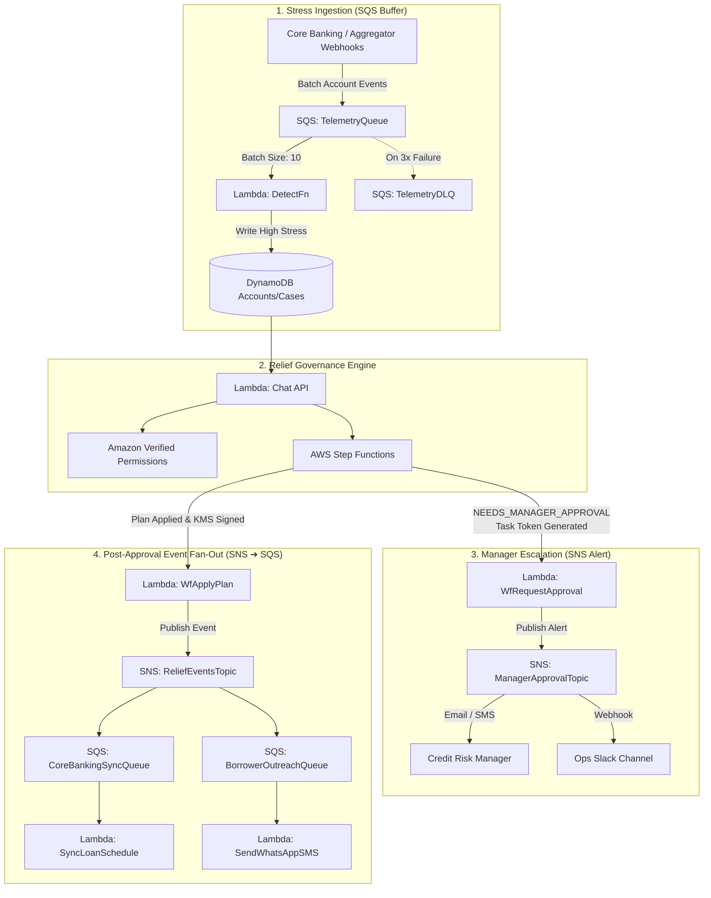

# CreditShield — SNS & SQS Architecture & Integration Guide

This document details where and why **Amazon SNS** and **Amazon SQS** are required in CreditShield, complete with CloudFormation (AWS SAM) resource definitions, architectural diagrams, and Lambda implementation snippets.

---

## 🧭 Executive Summary: Where & Why Are They Needed?

| Service | Component / Purpose | Why It's Needed | Free Tier Fit |
|---|---|---|---|
| **Amazon SNS** | **Manager Approval Alerts** (`ManagerApprovalTopic`) | Step Functions pauses on `waitForTaskToken`. Managers need an immediate push notification (Email, SMS, or Slack webhook) containing the case summary and direct action link. | 1,000,000 free publishes/month; 1,000 free email notifications/month. |
| **Amazon SQS** | **Telemetry Ingestion Buffer** (`TelemetryQueue` + DLQ) | Banks generate millions of daily transactions, balance snapshots, and bounced debit events. SQS buffers these events so `DetectFn` processes them smoothly without exceeding DynamoDB write limits or Lambda concurrency quotas. | 1,000,000 free requests/month forever. |
| **SNS ➔ SQS Fan-Out** | **Post-Relief Event Fan-out** (`ReliefEventsTopic`) | When a relief plan is applied, multiple downstream systems must react independently: Core Banking System (CBS) rescheduling, borrower WhatsApp/SMS dispatch, and regulatory audit ingestion. | Decouples core workflow from external third-party failures. |

---

## 🏛️ Architecture Flow with SNS & SQS



---

## 🛠️ Detailed Implementation Blueprint

### 1. Amazon SNS: Manager Escalation Alerts

#### Why It's Required:
When a requested concession exceeds the AI agent's autonomous limit (e.g., Arjun asking for a 30-day shift), Step Functions halts on `waitForTaskToken`. A human credit manager must be alerted immediately so the case does not hit the 24-hour timeout.

#### SAM / CloudFormation Definition (`template.yaml`):

```yaml
  # SNS Topic for Escalated Cases
  ManagerApprovalTopic:
    Type: AWS::SNS::Topic
    Properties:
      TopicName: creditshield-manager-approvals
      DisplayName: CreditShield Escalated Approvals

  # Optional Email Subscription (configured via parameter)
  ManagerEmailSubscription:
    Type: AWS::SNS::Subscription
    Properties:
      TopicArn: !Ref ManagerApprovalTopic
      Protocol: email
      Endpoint: risk-manager@harbourfinance.com  # Or parameterize via !Ref ApproverEmail
```

#### Lambda Publisher Code (`src/workflow/request_approval.py`):

```python
import json
import os
import boto3

sns = boto3.client('sns')
TOPIC_ARN = os.environ['MANAGER_APPROVAL_TOPIC_ARN']
PORTAL_BASE_URL = os.environ.get('PORTAL_BASE_URL', 'https://creditshield.bank.com')

def handler(event, context):
    case_id = event['case_id']
    plan = event['plan']
    task_token = event['taskToken']
    
    # Construct alert payload
    message = (
        f"🚨 [CreditShield] Concession Approval Required\n"
        f"--------------------------------------------------\n"
        f"Case ID:        {case_id}\n"
        f"Account:        {plan.get('account_id')}\n"
        f"Borrower:       {plan.get('borrower_name', 'Customer')}\n"
        f"Relief Type:    {plan.get('option_type')}\n"
        f"Requested Ask:  {plan.get('requested_value')} {plan.get('unit')}\n"
        f"Reasoning:      {plan.get('summary')}\n"
        f"--------------------------------------------------\n"
        f"Review & Sign-Off in Ops Portal:\n"
        f"{PORTAL_BASE_URL}/#approvals?case={case_id}&token={task_token[:20]}...\n"
    )

    sns.publish(
        TopicArn=TOPIC_ARN,
        Subject=f"Approval Needed: {case_id} ({plan.get('option_type')})",
        Message=message,
        MessageAttributes={
            'relief_type': {'DataType': 'String', 'StringValue': plan.get('option_type', 'GENERAL')},
            'stress_tier': {'DataType': 'String', 'StringValue': plan.get('stress_tier', 'HIGH')}
        }
    )

    return {"status": "NOTIFICATION_SENT", "case_id": case_id}
```

---

### 2. Amazon SQS: Banking Telemetry Ingestion Buffer

#### Why It's Required:
Lenders monitor thousands of accounts daily. Account aggregator balance dips, UPI bounce webhooks, and salary credit delays arrive in high-frequency bursts.
Without a queue:
- A burst of 1,000 simultaneous webhook calls can throttle Lambda concurrency or deplete DynamoDB Write Capacity Units (WCU).
- If a downstream evaluation encounters a transient fault, the event is permanently lost.

With SQS:
- Telemetry is buffered and processed in controlled micro-batches (e.g. 10 items at a time).
- A Dead Letter Queue (DLQ) captures malformed payloads for debugging without failing the pipeline.

#### SAM / CloudFormation Definition (`template.yaml`):

```yaml
  # Dead Letter Queue for Failed Telemetry Events
  TelemetryDLQ:
    Type: AWS::SQS::Queue
    Properties:
      QueueName: creditshield-telemetry-dlq
      MessageRetentionPeriod: 1209600 # 14 days

  # Main Telemetry Ingestion Queue
  TelemetryQueue:
    Type: AWS::SQS::Queue
    Properties:
      QueueName: creditshield-telemetry-queue
      VisibilityTimeout: 90 # 6x Lambda timeout (15s * 6)
      RedrivePolicy:
        deadLetterTargetArn: !GetAtt TelemetryDLQ.Arn
        maxReceiveCount: 3

  # Event Source Mapping connecting SQS to DetectFn
  DetectFnEventSource:
    Type: AWS::Lambda::EventSourceMapping
    Properties:
      EventSourceArn: !GetAtt TelemetryQueue.Arn
      FunctionName: !GetAtt DetectFunction.Arn
      BatchSize: 10
      MaximumBatchingWindowInSeconds: 5
      ScalingConfig:
        MaximumConcurrency: 5 # Protects DynamoDB WCU
```

#### Lambda Worker Code (`src/detect/app.py`):

```python
import json
import boto3
from decimal import Decimal

dynamodb = boto3.resource('dynamodb')
table_accounts = dynamodb.Table(os.environ['TABLE_ACCOUNTS'])

def handler(event, context):
    for record in event['Records']:
        payload = json.loads(record['body'])
        account_id = payload['account_id']
        balance_buffer = payload.get('balance_buffer_ratio', 1.0)
        dpd = payload.get('dpd', 0)
        bounced_debits = payload.get('bounced_debits_60d', 0)
        
        # Calculate Stress Score (0 to 100)
        stress_score = calculate_stress(balance_buffer, dpd, bounced_debits)
        
        if stress_score >= 60:
            # Mark account as High Stress & create/update outreach trigger
            table_accounts.update_item(
                Key={'account_id': account_id},
                UpdateExpression="SET stress_score = :s, stress_tier = :t, pre_default_flag = :f",
                ExpressionAttributeValues={
                    ':s': stress_score,
                    ':t': 'HIGH',
                    ':f': True
                }
            )
```

---

### 3. SNS ➔ SQS Fan-Out: Post-Relief Event Dispatch

#### Why It's Required:
When a borrower accepts an autonomous plan or a manager approves an escalation:
1. The Core Banking System (CBS) must be updated to extend the loan due date in the ledger.
2. The borrower must receive an official WhatsApp/SMS confirmation with a cryptographic hash receipt.
3. The compliance archive needs the KMS signature block for regulatory auditing.

Using an **SNS ➔ SQS Fan-Out** ensures that if the WhatsApp gateway is slow or failing, the Core Banking update proceeds unimpeded.

#### SAM / CloudFormation Definition (`template.yaml`):

```yaml
  # Post-Decision Event Topic
  ReliefEventsTopic:
    Type: AWS::SNS::Topic
    Properties:
      TopicName: creditshield-relief-events

  # Core Banking Queue subscribed to Relief Events
  CoreBankingSyncQueue:
    Type: AWS::SQS::Queue
    Properties:
      QueueName: creditshield-cbs-sync-queue

  # Borrower Communication Queue subscribed to Relief Events
  BorrowerCommQueue:
    Type: AWS::SQS::Queue
    Properties:
      QueueName: creditshield-borrower-comm-queue

  # SNS to SQS Subscriptions
  CbsSubscription:
    Type: AWS::SNS::Subscription
    Properties:
      TopicArn: !Ref ReliefEventsTopic
      Protocol: sqs
      Endpoint: !GetAtt CoreBankingSyncQueue.Arn
      RawMessageDelivery: true

  CommSubscription:
    Type: AWS::SNS::Subscription
    Properties:
      TopicArn: !Ref ReliefEventsTopic
      Protocol: sqs
      Endpoint: !GetAtt BorrowerCommQueue.Arn
      RawMessageDelivery: true

  # Queue Policies allowing SNS to push to SQS
  CbsQueuePolicy:
    Type: AWS::SQS::QueuePolicy
    Properties:
      Queues:
        - !Ref CoreBankingSyncQueue
      PolicyDocument:
        Statement:
          - Effect: Allow
            Principal:
              Service: sns.amazonaws.com
            Action: sqs:SendMessage
            Resource: !GetAtt CoreBankingSyncQueue.Arn
            Condition:
              ArnEquals:
                aws:SourceArn: !Ref ReliefEventsTopic
```

---

## 📊 Free Tier & Cost Impact Assessment

Both services fit cleanly into the AWS Free Tier with zero idle costs:

1. **Amazon SQS:**
   - **Free Tier:** 1,000,000 requests per month forever.
   - **Standby Cost:** **$0.00** (no hourly charges for idle queues).
   - **Volume in CreditShield:** 40 hero accounts + 1,000 simulated events = ~1,500 requests/month (0.15% of free tier).

2. **Amazon SNS:**
   - **Free Tier:** 1,000,000 Amazon SNS publishes per month; 100,000 HTTP/S notifications per month; 1,000 email deliveries per month.
   - **Standby Cost:** **$0.00**.
   - **Volume in CreditShield:** ~50 manager approval alerts + ~200 plan fan-outs = ~250 publishes/month (0.025% of free tier).

---

## 🚀 Step-by-Step Enablement Checklist

1. Append the SAM snippet to [`template.yaml`](../template.yaml).
2. Pass topic and queue ARNs to the respective Lambda environment variables.
3. Grant `sns:Publish` to `WfRequestApprovalFunction` and `WfApplyFunction`.
4. Grant `sqs:ReceiveMessage` and `sqs:DeleteMessage` to `DetectFunction`.
5. Run `sam build && sam deploy`.
