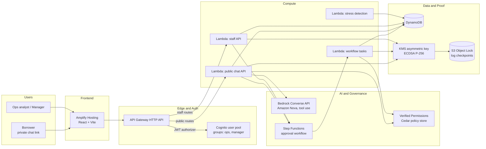

---

## 4. Architecture

### 4.1 Diagram



### 4.2 AWS services and why each is here

| Service | Role in Reprieve | Why this choice |
|---|---|---|
| Amplify Hosting | Hosts the React app, builds on every push to GitHub | Fastest path to a live HTTPS URL with CI |
| Cognito | Staff sign-in, groups `ops` and `manager` | Managed auth, JWT works directly with API Gateway |
| API Gateway (HTTP API) | REST endpoints, JWT authorizer, public routes for the borrower chat | Cheaper and simpler than REST API |
| Lambda (Python 3.12, arm64) | All business logic | Pay per use, no servers |
| DynamoDB (on-demand) | Accounts, cases, messages, approvals, decision log | No capacity planning, near-zero idle cost |
| Bedrock, Converse API | Conversational agent with tool use, Amazon Nova model | One API, cheap model, no external keys |
| Verified Permissions | Cedar policy store: the concession limits | Managed Cedar, policies editable without redeploy, returns which policy decided |
| Step Functions (Standard) | Approval workflow with human-in-the-loop callback (task token) | Visual execution graph is also a great demo asset |
| KMS (asymmetric, ECC_NIST_P256, SIGN_VERIFY) | Signs every decision-log entry | Private key never leaves KMS |
| S3 with Object Lock | Write-once checkpoints of the log head | Makes history rewriting detectable even for someone with database access |
| CloudWatch Logs | Lambda logs, structured JSON | Free with Lambda, useful in the video |
| IAM, SAM/CloudFormation | Least-privilege roles, infrastructure as code | Reproducible, reviewable |
| Optional (Tier 2) | EventBridge Scheduler, SES, SNS, Bedrock Guardrails | See Section 3 |

### 4.3 Key design decisions (record these in the README as "architecture decisions")

1. **Two-tier authorization.** First ask Cedar "may the AI agent do this?". If not, ask "may a manager?". If not, nobody may. This gives the three outcomes with one policy store.
2. **Limits probing.** So the agent does not propose things that will be refused, a tool asks Cedar about a small ladder of values (batch API) and returns what is allowed alone and what needs a manager.
3. **Serverless and on-demand everywhere.** Idle cost is close to zero. State this in the cost section of the README.
4. **Cheapest suitable model.** Amazon Nova Lite through the Converse API. The model ID is an environment variable, never hard-coded.
5. **Do not use Amazon QLDB.** It has been discontinued. The tamper-evidence design is hash chain plus KMS signatures plus Object Lock checkpoints.
6. **No native-extension Python dependencies in Lambda** (no pydantic, numpy, pandas, cryptography). `sam build` must stay trivial. Use `dataclasses` and manual validation. Compute statistics with the `math` module.
7. **Money is an integer number of whole currency units** (rupees). No floats anywhere in money or limit logic. Cedar has no floating point either. In production one would use minor units; this is a stated simplification.
8. **HashRouter in the frontend** so no SPA rewrite rule is needed on Amplify.
9. **Public chat is untrusted input.** Rate limit, cap message count and length, expire tokens, and rely on Cedar (not the prompt) for enforcement.

---

## 5. Tech stack and repository layout

### 5.1 Stack

| Layer | Choice |
|---|---|
| Infra as code | AWS SAM (`template.yaml`), deploy with `sam build` and `sam deploy` |
| Backend | Python 3.12, `boto3` (provided by the Lambda runtime), standard library. Tests with `pytest` |
| Agent | Bedrock Converse API with tool use, plain `boto3` loop (about 60 lines). Optional later: Strands Agents SDK |
| Frontend | React 18.3, Vite, TypeScript, Tailwind CSS 3.4, `react-router-dom` v6 with `HashRouter`, TanStack Query v5, `aws-amplify` v6 (Auth module only), `recharts`, `lucide-react` |
| Fonts | `@fontsource/public-sans`, `@fontsource/jetbrains-mono` (self-hosted through npm, no external font requests) |
| Hosting | Amplify Hosting connected to the GitHub repo (monorepo, app root `frontend`) |
| Region | Default `ap-south-1`. Fallback `us-east-1` if preflight finds any service unavailable |

### 5.2 Repository layout

```
reprieve/
  PROJECT_SPEC.md              # this file
  README.md                    # problem, architecture, AWS usage, decisions, cost, learnings, limits
  LICENSE                      # MIT
  amplify.yml                  # monorepo build for Amplify
  template.yaml                # SAM: all AWS resources
  samconfig.toml               # created by sam deploy --guided
  backend/
    src/
      common/                  # config.py, ddb.py, jsonutil.py, auth.py, money.py
      domain/                  # stress.py, plan.py, adapters.py (simulated core banking)
      governance/              # authorize.py (Cedar), decisionlog.py, verifier.py
      agent/                   # prompts.py, tools.py, loop.py, personas.py
      handlers/                # public_api.py, staff_api.py, detect.py, wf_*.py
    tests/
    requirements.txt           # empty or dev-only
  statemachine/
    relief_case.asl.json
  cedar/
    schema.cedarschema.json
    policies/*.cedar
  frontend/
    src/ (pages, components, lib, styles)
    index.html, vite.config.ts, tailwind.config.js, package.json
  scripts/
    preflight.py               # checks credentials, region, service availability, Bedrock call
    write_env.py               # reads stack outputs, writes frontend/.env.local, prints Amplify env values
    create_users.py            # creates Cognito users and groups (prompts for password)
    sync_policies.py           # pushes cedar/policies/*.cedar to the policy store
    seed.py                    # loads hero + filler accounts
    smoke.py                   # end-to-end check against the deployed API
  docs/
    HUMAN_TODO.md, DECISIONS.md, SIMULATION_ASSUMPTIONS.md, DEMO_SCRIPT.md, SUBMISSION.md
```

---

## 6. Data model (DynamoDB, on-demand billing)

Table names are `${StackName}-<name>`. Pass names to Lambdas through environment variables.

**Conventions:** ISO 8601 UTC strings for timestamps. IDs are strings. Money and limits are integers. Booleans are booleans. DynamoDB returns numbers as `Decimal`: convert with a shared `jsonutil.normalize()` before JSON encoding or hashing (integral Decimal becomes `int`).

### 6.1 Tables

**`accounts`** (PK `account_id`)

| Attribute | Type | Notes |
|---|---|---|
| name, first_name | S | Fictional |
| segment | S | `GIG`, `SHOP_OWNER`, `SALARIED` |
| product | S | `TWO_WHEELER`, `MICRO_BUSINESS`, `PERSONAL_LOAN` |
| emi, outstanding | N | Whole rupees |
| emi_day | N | 1 to 28 |
| next_due_date | S | ISO date |
| dpd | N | Days past due |
| prior_reliefs | N | Number of past relief plans |
| legal_hold | BOOL | |
| late_fee_due | N | Whole rupees, 0 if none |
| cashflow | M | `income_prior_avg`, `income_last30`, `bounced_60d`, `avg_balance_7d` (all integers) |
| stress_score, stress_tier, stress_factors | N, S, L | Filled by detection |
| cohort | S | `TREATED` or `CONTROL`, set at flagging time |
| latest_case_id | S | |
| outcome | S | `CURED` or `NOT_CURED`, from simulation |
| concession_cost | N | Whole rupees of concessions granted |

GSI `by_tier`: PK `stress_tier`, SK `stress_score`.

**`cases`** (PK `case_id`)

`account_id`, `status` (`OPEN`, `PLAN_PROPOSED`, `PENDING_APPROVAL`, `APPLIED`, `DECLINED`, `ESCALATED`, `REJECTED`, `CLOSED`, `ARCHIVED`), `borrower_token` (32 random bytes, URL-safe), `token_expires_at`, `plan` (map, see 6.2), `msg_count`, `sfn_execution_arn`, `created_at`, `updated_at`. GSI `by_token` (PK `borrower_token`), GSI `by_account` (PK `account_id`).

**`messages`** (PK `case_id`, SK `ts_id` = `<iso ts>#<uuid>`)

`role` (`borrower`, `agent`, `system`, `staff`), `text`, `tool_trace` (optional list of `{name, input, output_summary}`), `verifier` (`pass`, `regenerated`, `fallback`, optional), `simulated` (bool), `usage` (optional `{input_tokens, output_tokens}`).

**`approvals`** (PK `approval_id`)

`case_id`, `plan_id`, `task_token`, `action`, `params`, `borrower_reason`, `status` (`PENDING`, `APPROVED`, `REJECTED`, `TIMEOUT`), `requested_at`, `decided_by`, `decided_at`, `decision_note`, `authority_check` (map). GSI `by_status` (PK `status`, SK `requested_at`).

**`decisionlog`** (PK `case_id`, SK `seq` as a number). Full schema in Section 11.

### 6.2 The plan object (stored on the case)

```json
{
  "plan_id": "p_01",
  "action": "DUE_DATE_SHIFT",
  "params": {"days": 7},
  "summary": "Move the next EMI from 26 Sep to 3 Oct.",
  "outcome": "ALLOWED",
  "envelope": {"param": "days", "requested": 7, "agent_max": 10, "manager_max": 30, "unit": "days"},
  "determining_policies": [{"id": "abc", "description": "Agent may shift due date up to 10 days when dpd <= 30 and prior reliefs < 2"}],
  "status": "PROPOSED"
}
```

Plan `status`: `PROPOSED`, `ACCEPTED`, `PENDING_APPROVAL`, `APPLIED`, `REJECTED`, `DECLINED`, `SUPERSEDED`. `action` is one of `DUE_DATE_SHIFT`, `PARTIAL_PLAN`, `TENURE_EXTENSION`, `FEE_WAIVER`.

### 6.3 Seed data (`scripts/seed.py`)

Use a fixed random seed (42) and an `--as-of` date (default today) so re-running is repeatable. **Do not create a transactions table**: features are stored on the account (`cashflow`). In production these would come from a consented cash-flow feed. Say so in the README.

Hero accounts (fictional). Set `emi_day` so `days_to_emi` matches the value below relative to `--as-of`.

| Account | Segment / product | EMI | Outstanding | dpd | prior_reliefs | legal_hold | late_fee_due | income_prior_avg | income_last30 | bounced_60d | avg_balance_7d | days_to_emi |
|---|---|---|---|---|---|---|---|---|---|---|---|---|
| ACC-1001 Meera Iyer | GIG / TWO_WHEELER | 6200 | 88000 | 0 | 0 | false | 350 | 28000 | 12500 | 1 | 2100 | 6 |
| ACC-1002 Arjun Mehta | SHOP_OWNER / MICRO_BUSINESS | 14500 | 310000 | 9 | 1 | false | 1200 | 62000 | 31000 | 2 | 3800 | 3 |
| ACC-1003 Sana Qureshi | SALARIED / PERSONAL_LOAN | 9800 | 210000 | 35 | 2 | false | 800 | 45000 | 31500 | 2 | 5000 | 20 |
| ACC-1004 Vikram Rao | SALARIED / PERSONAL_LOAN | 11000 | 260000 | 20 | 1 | **true** | 600 | 52000 | 30000 | 1 | 4000 | 5 |

Filler: about 36 accounts with plausible random values. Roughly 60% healthy (no drop), 25% watch, 15% high stress. Assign Indian-sounding fictional names. Hero accounts are forced to `TREATED`. Filler cohorts use a deterministic hash: `int(sha256(account_id).hexdigest(), 16) % 2` gives 0 for `TREATED`, 1 for `CONTROL`, but only for accounts flagged at or above the WATCH tier.

Provide `--reset-heroes` to restore hero accounts to their initial state and mark their earlier cases `ARCHIVED`, so the demo can be re-recorded.

---

## 7. Stress detection (deterministic, explainable)

No machine learning. Hand-set weights, documented as illustrative in the README ("not a credit model").

**Inputs per account:** `income_prior_avg`, `income_last30`, `bounced_60d`, `avg_balance_7d`, `emi`, `dpd`, `days_to_emi` (derived from `emi_day` and the as-of date).

**Derived:**

- `income_drop_pct = round(max(0, (income_prior_avg - income_last30) / income_prior_avg * 100))`
- `buffer_ratio = avg_balance_7d / emi`

**Points (sum, then cap at 100):**

| Factor | Rule |
|---|---|
| Income drop | `min(40, floor(income_drop_pct * 0.7))` |
| Bounced debits | `min(25, bounced_60d * 13)` |
| Balance buffer | `buffer_ratio < 0.25` gives 20, `< 0.5` gives 12, `< 1.0` gives 6, else 0 |
| EMI proximity | `days_to_emi <= 7 and buffer_ratio < 1` gives 10, `<= 14 and buffer_ratio < 1` gives 5, else 0 |
| Days past due | 0 gives 0, 1 to 14 gives 5, 15 or more gives 10 |

**Tiers:** `HIGH` at 60 or above, `WATCH` 35 to 59, `LOW` below 35.

**Expected scores for the hero accounts** (add these as unit tests): Meera 73 (HIGH), Arjun 87 (HIGH), Sana 62 (HIGH), Vikram 74 (HIGH).

**Output:** `stress_score`, `stress_tier`, and `stress_factors` as a list of `{name, points, note}` where `note` is plain language (for example "Income fell 55% against the 3-month average"). Detection is idempotent: re-running it never opens duplicate cases and never changes an existing cohort.

**Endpoint:** `POST /admin/detect` scores all accounts, writes results, assigns cohorts to newly flagged accounts (score at or above 35), and logs `STRESS_FLAGGED` for accounts that get a case later (the log entry is created when the case is opened, using the stored factors).
